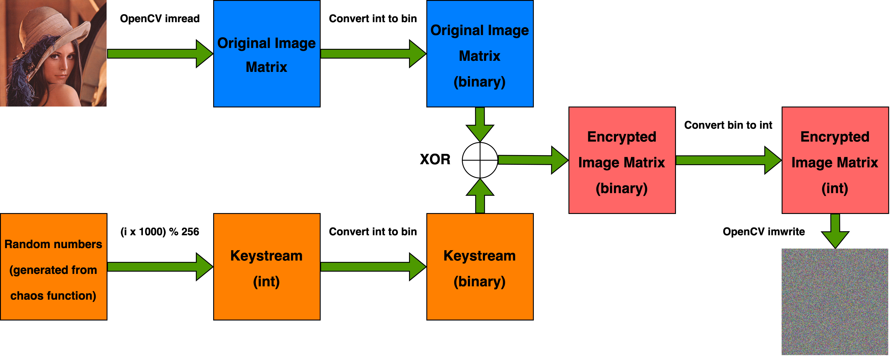
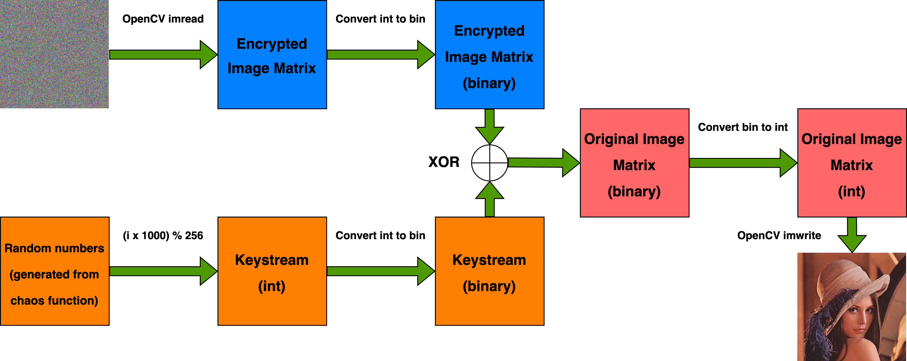

<div align="center">

# CIE (Chaos-based Image Encryption)

<div align="left">

<!-- <h2 id="first-section">What is this repo about?</h2> -->
## What is this repo about?

This repository contains a web application for image encryption and comparison.

The app allows users to upload an image and generate an encrypted version. This encryption is done using an XOR operation between the original image and a keystream. The keystream is generated using a chaos-based function.

Additionally, the app includes tools to compare the decrypted image with the original. Users can calculate the RMSE (Root Mean Square Error) and PSNR (Peak Signal-to-Noise Ratio) between the images, giving insight into the accuracy of the decryption process.

The app is built with HTML, CSS, JavaScript, and Flask, creating a simple yet effective interface for encryption and comparison tasks.

## Before using this repo...

First, clone this repo to your local machine. Then, create a new Conda environment with its dependencies by executing the following command in the terminal or console.

```
conda env create --file requirements.yml
```

After the environment is created, activate it with:

```
conda activate chaos-im-enc
```

## How to use this repo?

To launch the web application, execute the following command in the terminal/console.

> Ensure that your current working directory is set to the cloned repo.

```
python backend.py
```

Once the `Debugger is activated!` message appear in the terminal, open the browser (Chrome, Firefox, Safari, etc.) and go to `localhost:8000`. The web application is now ready to use!

## Demo

The tutorial video on how to use the web app is provided below.


## How does this repo work?

Below are the diagram on how the encryption and decryption works.

**Encryption**


Assume that $I$ is original image, $K$ is keystream, and $O$ is encrypted image. To add more layer of security, rather than just

$$O(i)=I(i)\oplus K(i)$$

the output is give as follows.

$$O(i)=I(i)\oplus K(i)\oplus O(i-1)$$

**Decryption**


From the previous equation, the original image can be restored by the following equation.

$$I(i)=O(i)\oplus O(i-1)\oplus K(i)$$

### Chaos function
The behavior of a chaos function determined by its initial value. The chaos functions used in this repo are as follows.

**Gauss Iterated Map**

$$x_{n+1}=\exp \left(-\alpha x_n^2\right)+\beta$$

**Circle Map**

$$x_{n+1}=x_n+\Omega-\frac{K}{2\pi}\sin\left(2\pi x_n\right)\mod 1$$

**Circle-Gauss Iterated Composition Map**

$$(f\circ g)=x_{n+1}=\exp \left(-\alpha \left(x_n + \Omega-\frac{K}{2\pi}\sin\left(2\pi x_n\right)\mod 1\right)^2\right)+\beta$$
